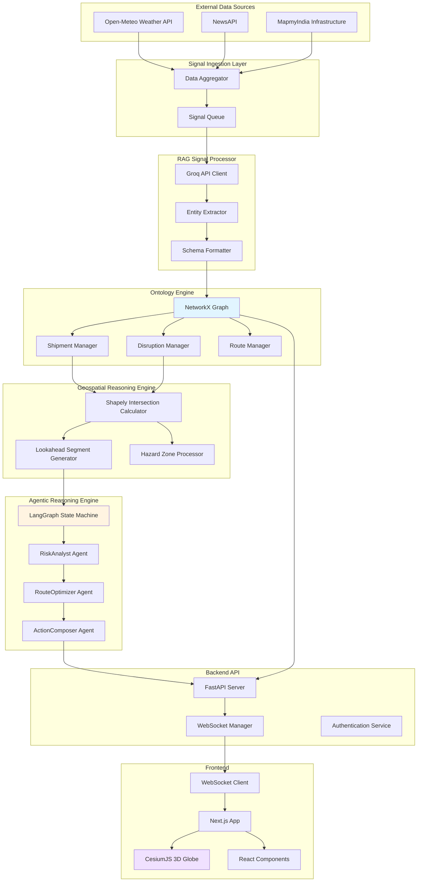
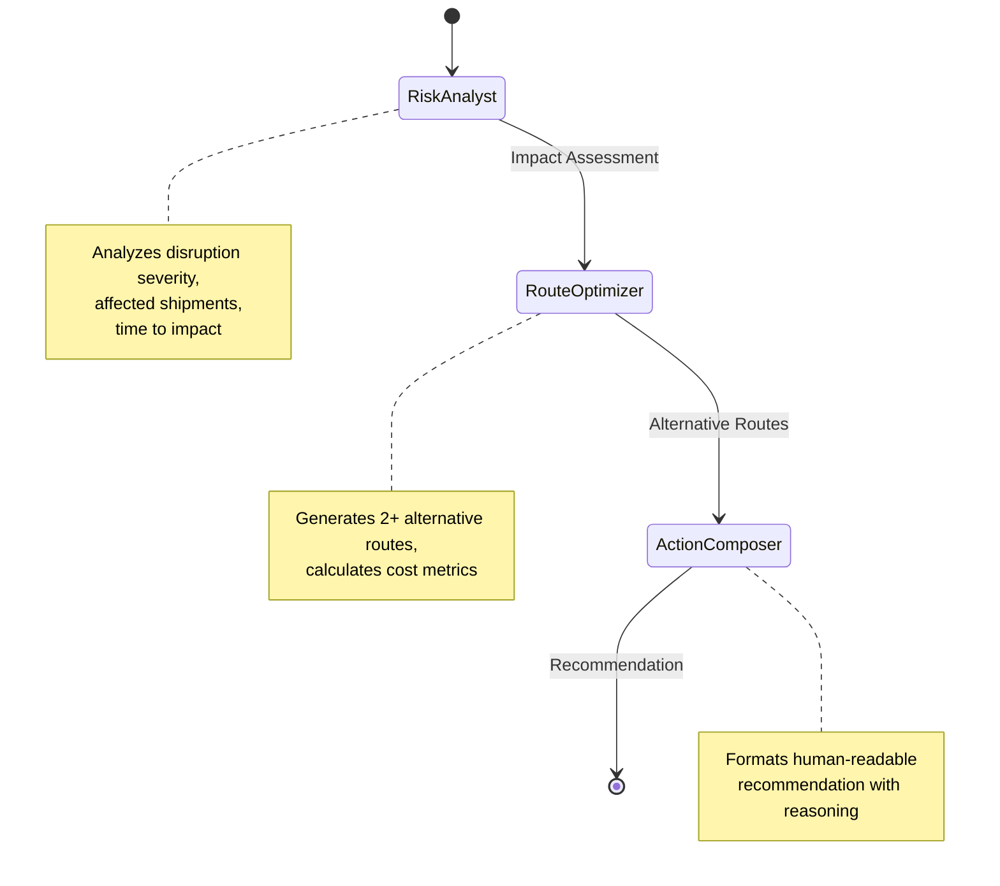

# Design Document: LogosGotham Intelligence Platform

## Overview

LogosGotham is a proactive logistics intelligence system that transforms reactive shipment tracking into predictive disruption management for the Indian logistics network. The platform ingests real-time environmental signals (weather, news, infrastructure alerts), extracts structured geospatial hazard data using LLM-powered RAG processing, maintains a live digital twin of shipments and routes in a graph database, performs spatial intersection analysis to detect route-hazard conflicts, and employs autonomous AI agents to generate cost-analyzed reroute recommendations for human approval.

The system architecture follows a layered approach:
- **Signal Ingestion Layer**: Multi-source data aggregation from weather APIs, news feeds, and infrastructure alerts
- **RAG Signal Processor**: LLM-based entity extraction and schema formatting using Groq API with Llama 3
- **Ontology Engine**: In-memory graph database (NetworkX) maintaining the digital twin
- **Geospatial Reasoning Engine**: Spatial intersection calculations using Shapely
- **Agentic Reasoning Engine**: LangGraph state machine with three specialized agents (RiskAnalyst, RouteOptimizer, ActionComposer)
- **Intelligence Map**: 3D visualization interface using CesiumJS and React/Next.js

The platform supports three user roles:
- **Admin**: Full access to monitoring, reroute approval, and system controls
- **Seller**: Shipment creation and tracking capabilities
- **Receiver**: Read-only access to incoming shipment status

## Architecture

### System Architecture Diagram



### Component Interaction Flow

1. **Signal Ingestion Flow**: External APIs → Data Aggregator → Signal Queue → RAG Processor → Ontology Engine
2. **Disruption Detection Flow**: Ontology Engine → Geospatial Reasoning Engine → Intersection Events → Agentic Reasoning Engine
3. **Reroute Recommendation Flow**: Agentic Reasoning Engine → Backend API → WebSocket → Frontend → Admin Approval → Ontology Engine Update
4. **Shipment Tracking Flow**: GPS Updates → Ontology Engine → WebSocket Broadcast → Frontend Real-time Display

### Technology Stack

**Backend:**
- Python 3.11+
- FastAPI for REST API and WebSocket server
- NetworkX for graph database operations
- Shapely for geospatial calculations
- LangGraph for agent orchestration
- Groq API client for LLM inference
- Pydantic for data validation

**Frontend:**
- Next.js 14 (React 18)
- TypeScript
- CesiumJS for 3D globe rendering
- TailwindCSS for styling
- WebSocket client for real-time updates
- React Query for state management

**External Services:**
- Groq API (Llama 3 model)
- Open-Meteo Weather API
- NewsAPI
- MapmyIndia Routing and Geocoding API

## Components and Interfaces

### Signal Ingestion Layer

**Purpose**: Aggregate real-time environmental data from multiple external sources and forward to processing pipeline.

**Components:**
- `DataAggregator`: Polls external APIs at 5-minute intervals
- `SignalQueue`: In-memory queue for buffering incoming signals
- `SourceMonitor`: Tracks availability of each data source

**Interfaces:**

```python
class SignalIngestionLayer:
    async def poll_weather_api(self) -> List[WeatherSignal]
    async def poll_news_api(self) -> List[NewsSignal]
    async def poll_infrastructure_api(self) -> List[InfrastructureSignal]
    async def enqueue_signal(self, signal: RawSignal) -> None
    def get_source_status(self) -> Dict[str, bool]
```

**Configuration:**
- Poll interval: 5 minutes (configurable)
- Retry policy: 3 attempts with exponential backoff
- Timeout: 10 seconds per API call

### RAG Signal Processor

**Purpose**: Extract structured geospatial data from unstructured text using LLM-powered entity extraction.

**Components:**
- `GroqAPIClient`: Manages API calls to Groq with retry logic
- `EntityExtractor`: Prompts LLM to extract location, time, type, severity
- `GeocodingService`: Converts location names to coordinates using MapmyIndia
- `SchemaFormatter`: Constructs DisruptionObject with validated polygon

**Interfaces:**

```python
class RAGSignalProcessor:
    async def process_signal(self, raw_signal: RawSignal) -> Optional[DisruptionObject]
    async def extract_entities(self, text: str) -> ExtractedEntities
    async def geocode_location(self, location: str) -> Coordinates
    def format_disruption_object(self, entities: ExtractedEntities) -> DisruptionObject
```

**LLM Prompt Template:**
```
Extract the following information from this logistics alert:
- Location: Geographic location affected (city, region, or landmark)
- Start Time: When the disruption begins (ISO 8601 format)
- Duration: How long the disruption lasts (in hours)
- Type: Category (weather, infrastructure, traffic, protest)
- Severity: Impact level (low, medium, high, critical)

Alert: {raw_text}

Return JSON format:
{
  "location": "...",
  "start_time": "...",
  "duration_hours": ...,
  "type": "...",
  "severity": "..."
}
```

**Processing Time Budget**: 3 seconds per signal

### Ontology Engine

**Purpose**: Maintain an in-memory graph database representing the digital twin of shipments, routes, and disruptions.

**Components:**
- `GraphDatabase`: NetworkX graph instance with node/edge operations
- `ShipmentManager`: CRUD operations for shipment nodes
- `DisruptionManager`: CRUD operations for disruption nodes
- `RouteManager`: CRUD operations for route nodes
- `QueryEngine`: Optimized queries for active entities

**Interfaces:**

```python
class OntologyEngine:
    # Shipment operations
    def create_shipment(self, shipment: ShipmentCreate) -> Shipment
    def update_shipment_location(self, shipment_id: str, location: Coordinates) -> None
    def update_shipment_route(self, shipment_id: str, route: Route) -> None
    def get_active_shipments(self) -> List[Shipment]
    
    # Disruption operations
    def add_disruption(self, disruption: DisruptionObject) -> None
    def remove_disruption(self, disruption_id: str) -> None
    def get_active_disruptions(self) -> List[DisruptionObject]
    
    # Route operations
    def calculate_route(self, origin: Coordinates, destination: Coordinates) -> Route
    def validate_route(self, route: Route) -> ValidationResult
    
    # Query operations
    def query_shipments_by_status(self, status: str) -> List[Shipment]
    def query_disruptions_by_severity(self, severity: str) -> List[DisruptionObject]
```

**Performance Requirements:**
- Node creation: < 100ms
- Node update: < 100ms
- Query all active shipments: < 50ms
- Query all active disruptions: < 50ms

### Geospatial Reasoning Engine

**Purpose**: Perform spatial intersection calculations between shipment routes and hazard zones.

**Components:**
- `LookaheadCalculator`: Generates 15km forward segment along route
- `IntersectionDetector`: Uses Shapely to detect polygon intersections
- `DistanceCalculator`: Computes distance from current position to hazard
- `PriorityQueue`: Orders intersection events by severity

**Interfaces:**

```python
class GeospatialReasoningEngine:
    def calculate_lookahead_segment(self, shipment: Shipment) -> LineString
    def detect_intersections(self, segment: LineString, hazards: List[DisruptionObject]) -> List[IntersectionEvent]
    def calculate_distance_to_hazard(self, current_pos: Coordinates, hazard: DisruptionObject) -> float
    def prioritize_by_severity(self, events: List[IntersectionEvent]) -> List[IntersectionEvent]
```

**Algorithms:**
- Lookahead segment: Extract next 15km of route waypoints from current position
- Intersection detection: Shapely `intersects()` method on LineString and Polygon
- Distance calculation: Shapely `distance()` method

**Performance Requirements:**
- Intersection calculation: < 500ms per shipment
- Batch processing: < 2 seconds for 1000 shipments


### Agentic Reasoning Engine

**Purpose**: Orchestrate three specialized AI agents to analyze disruptions, generate reroute options, and compose actionable recommendations.

**Architecture**: LangGraph state machine with sequential agent invocation

**Agent Workflow:**



**Components:**

1. **RiskAnalyst Agent**
   - Assesses disruption impact on shipment
   - Calculates time to reach hazard zone
   - Determines urgency level
   - Output: Risk assessment with urgency score

2. **RouteOptimizer Agent**
   - Queries MapmyIndia API for alternative routes avoiding hazard
   - Generates minimum 2 alternative routes (when feasible)
   - Calculates metrics for each route:
     - Additional distance (km)
     - Additional time (minutes)
     - Fuel cost (8 INR/km)
     - Driver overtime cost (if > 2 hours additional)
   - Output: List of RerouteOption objects with cost analysis

3. **ActionComposer Agent**
   - Formats recommendation in human-readable text
   - Explains disruption context and reasoning
   - Presents cost-benefit analysis
   - Suggests best option or delay recommendation
   - Output: Structured recommendation for admin approval

**Interfaces:**

```python
class AgenticReasoningEngine:
    async def process_intersection_event(self, event: IntersectionEvent) -> Recommendation
    
class RiskAnalystAgent:
    async def assess_risk(self, event: IntersectionEvent, shipment: Shipment) -> RiskAssessment
    
class RouteOptimizerAgent:
    async def generate_alternatives(self, shipment: Shipment, hazard: DisruptionObject) -> List[RerouteOption]
    async def calculate_cost_metrics(self, original_route: Route, alternative_route: Route) -> CostMetrics
    
class ActionComposerAgent:
    async def compose_recommendation(self, risk: RiskAssessment, options: List[RerouteOption]) -> Recommendation
```

**State Machine Schema:**

```python
class AgentState(TypedDict):
    intersection_event: IntersectionEvent
    shipment: Shipment
    risk_assessment: Optional[RiskAssessment]
    reroute_options: Optional[List[RerouteOption]]
    recommendation: Optional[Recommendation]
```

**Performance Requirements:**
- Full agent workflow: < 5 seconds per intersection event
- Parallel processing for multiple affected shipments

### Backend API

**Purpose**: Provide REST API endpoints and WebSocket server for frontend communication.

**Framework**: FastAPI with async/await support

**REST Endpoints:**

```python
# Authentication
POST /api/auth/login
POST /api/auth/logout
GET /api/auth/me

# Shipments
POST /api/shipments/create
GET /api/shipments/{shipment_id}
GET /api/shipments/active
PATCH /api/shipments/{shipment_id}/location
PATCH /api/shipments/{shipment_id}/status

# Disruptions
GET /api/disruptions/active
GET /api/disruptions/historical?start_date=...&end_date=...

# Reroutes
POST /api/reroutes/{recommendation_id}/approve
POST /api/reroutes/{recommendation_id}/reject

# Reports
POST /api/reports/generate?start_date=...&end_date=...
```

**WebSocket Protocol:**

```typescript
// Client → Server
{
  "type": "subscribe",
  "channels": ["shipments", "disruptions", "recommendations"]
}

// Server → Client: Shipment Update
{
  "type": "shipment_update",
  "data": {
    "shipment_id": "...",
    "location": {"lat": ..., "lon": ...},
    "timestamp": "..."
  }
}

// Server → Client: Disruption Alert
{
  "type": "disruption_alert",
  "data": {
    "disruption_id": "...",
    "type": "weather",
    "severity": "critical",
    "polygon": [...]
  }
}

// Server → Client: Reroute Recommendation
{
  "type": "reroute_recommendation",
  "data": {
    "recommendation_id": "...",
    "shipment_id": "...",
    "options": [...],
    "reasoning": "..."
  }
}
```

**Authentication:**
- JWT-based authentication
- Role-based access control (RBAC)
- Session timeout: 8 hours
- Token refresh mechanism

**Interfaces:**

```python
class BackendAPI:
    # WebSocket management
    async def handle_websocket_connection(self, websocket: WebSocket, user: User) -> None
    async def broadcast_shipment_update(self, shipment: Shipment) -> None
    async def broadcast_disruption_alert(self, disruption: DisruptionObject) -> None
    async def send_recommendation(self, user_id: str, recommendation: Recommendation) -> None
    
    # Authentication
    async def authenticate_user(self, credentials: Credentials) -> User
    async def authorize_action(self, user: User, action: str, resource: str) -> bool
```

### Frontend Intelligence Map

**Purpose**: Provide 3D visualization interface for monitoring operations and approving reroutes.

**Framework**: Next.js 14 with React 18 and TypeScript

**Key Components:**

1. **CesiumGlobe Component**
   - Renders 3D Earth using CesiumJS
   - Displays shipment markers with real-time updates
   - Displays route polylines
   - Displays hazard zone polygons with color-coded severity
   - Camera controls (pan, zoom, rotate)

2. **ShipmentMarker Component**
   - 3D marker positioned at shipment coordinates
   - Click handler to show shipment details popup
   - Real-time position updates via WebSocket

3. **HazardZone Component**
   - Semi-transparent 3D polygon
   - Color coding: yellow (low), orange (medium), red (high), purple (critical)
   - Pulsing animation for critical severity
   - Click handler to show disruption details

4. **RecommendationPanel Component**
   - Displays pending reroute recommendations
   - Shows original route vs alternative routes
   - Displays cost comparison table
   - AI reasoning explanation
   - Approve/Reject buttons

5. **ShipmentCreationForm Component**
   - Form for Seller users to create shipments
   - Origin/destination input with geocoding
   - Cargo details input
   - Route preview on globe

6. **ReceiverDashboard Component**
   - Read-only view for Receiver users
   - Filtered shipment list (destination = user)
   - ETA display with automatic updates

**Interfaces:**

```typescript
interface IntelligenceMapProps {
  user: User;
  websocketUrl: string;
}

interface CesiumGlobeProps {
  shipments: Shipment[];
  disruptions: DisruptionObject[];
  selectedShipment?: Shipment;
  onShipmentClick: (shipment: Shipment) => void;
  onDisruptionClick: (disruption: DisruptionObject) => void;
}

interface RecommendationPanelProps {
  recommendation: Recommendation;
  onApprove: (recommendationId: string, optionId: string) => void;
  onReject: (recommendationId: string, reason: string) => void;
}
```

**State Management:**
- React Query for server state
- React Context for WebSocket connection
- Local state for UI interactions

**Performance Optimizations:**
- Virtualization for large entity lists
- Debounced camera updates
- Lazy loading of historical data
- WebGL rendering optimizations


## Data Models

### DisruptionObject Schema

Represents a geospatial hazard with polygon boundaries and metadata.

```python
from pydantic import BaseModel, Field, validator
from typing import List, Literal
from datetime import datetime

class Coordinates(BaseModel):
    lat: float = Field(..., ge=-90, le=90)
    lon: float = Field(..., ge=-180, le=180)

class DisruptionObject(BaseModel):
    id: str = Field(..., description="Unique identifier")
    type: Literal["weather", "infrastructure", "traffic", "protest"]
    severity: Literal["low", "medium", "high", "critical"]
    polygon: List[Coordinates] = Field(..., min_items=3)
    start_time: datetime
    end_time: datetime
    description: str
    source: str = Field(..., description="Data source that generated this disruption")
    
    @validator("polygon")
    def validate_closed_polygon(cls, v):
        if len(v) < 3:
            raise ValueError("Polygon must have at least 3 points")
        # Check if first and last points are the same (closed polygon)
        if v[0] != v[-1]:
            v.append(v[0])  # Close the polygon
        return v
    
    @validator("end_time")
    def validate_time_range(cls, v, values):
        if "start_time" in values and v <= values["start_time"]:
            raise ValueError("end_time must be after start_time")
        return v
```

**JSON Example:**

```json
{
  "id": "disruption_001",
  "type": "weather",
  "severity": "high",
  "polygon": [
    {"lat": 28.6139, "lon": 77.2090},
    {"lat": 28.7041, "lon": 77.1025},
    {"lat": 28.5355, "lon": 77.3910},
    {"lat": 28.6139, "lon": 77.2090}
  ],
  "start_time": "2024-01-15T14:00:00Z",
  "end_time": "2024-01-15T20:00:00Z",
  "description": "Heavy rainfall causing road flooding in Delhi NCR",
  "source": "Open-Meteo"
}
```

### Shipment Schema

Represents a logistics entity with origin, destination, and tracking information.

```python
class Shipment(BaseModel):
    id: str = Field(..., description="Unique identifier")
    origin: Coordinates
    destination: Coordinates
    current_location: Coordinates
    status: Literal["pending", "in_transit", "delivered"]
    dispatch_time: Optional[datetime] = None
    delivery_time: Optional[datetime] = None
    estimated_arrival: datetime
    route_id: str
    cargo_details: Dict[str, Any]
    seller_id: str
    receiver_id: str
    created_at: datetime = Field(default_factory=datetime.utcnow)
    updated_at: datetime = Field(default_factory=datetime.utcnow)
```

**JSON Example:**

```json
{
  "id": "shipment_001",
  "origin": {"lat": 28.7041, "lon": 77.1025},
  "destination": {"lat": 19.0760, "lon": 72.8777},
  "current_location": {"lat": 28.7041, "lon": 77.1025},
  "status": "in_transit",
  "dispatch_time": "2024-01-15T08:00:00Z",
  "delivery_time": null,
  "estimated_arrival": "2024-01-17T18:00:00Z",
  "route_id": "route_001",
  "cargo_details": {
    "weight_kg": 500,
    "type": "electronics",
    "value_inr": 100000
  },
  "seller_id": "seller_123",
  "receiver_id": "receiver_456",
  "created_at": "2024-01-15T07:30:00Z",
  "updated_at": "2024-01-15T12:00:00Z"
}
```

### Route Schema

Represents a geographic path with waypoints and road segments.

```python
class Waypoint(BaseModel):
    coordinates: Coordinates
    sequence: int
    estimated_arrival: datetime

class RoadSegment(BaseModel):
    start: Coordinates
    end: Coordinates
    distance_km: float
    estimated_duration_minutes: float
    road_type: str

class Route(BaseModel):
    id: str
    waypoints: List[Waypoint] = Field(..., min_items=2)
    road_segments: List[RoadSegment]
    total_distance_km: float
    total_duration_minutes: float
    created_at: datetime = Field(default_factory=datetime.utcnow)
    
    @validator("waypoints")
    def validate_waypoint_sequence(cls, v):
        sequences = [w.sequence for w in v]
        if sequences != sorted(sequences):
            raise ValueError("Waypoints must be in sequential order")
        return v
```

### RerouteOption Schema

Represents an alternative route with cost analysis.

```python
class CostMetrics(BaseModel):
    additional_distance_km: float
    additional_time_minutes: float
    fuel_cost_inr: float
    overtime_cost_inr: float = 0.0
    total_additional_cost_inr: float
    
    @validator("total_additional_cost_inr", always=True)
    def calculate_total(cls, v, values):
        return round(values.get("fuel_cost_inr", 0) + values.get("overtime_cost_inr", 0), 2)

class RerouteOption(BaseModel):
    id: str
    route: Route
    cost_metrics: CostMetrics
    avoids_hazards: List[str] = Field(..., description="List of disruption IDs avoided")
    confidence_score: float = Field(..., ge=0, le=1)
```

### Recommendation Schema

Represents an AI-generated reroute recommendation for admin approval.

```python
class RiskAssessment(BaseModel):
    urgency_score: float = Field(..., ge=0, le=1)
    time_to_impact_minutes: float
    affected_shipment_count: int
    severity_level: Literal["low", "medium", "high", "critical"]

class Recommendation(BaseModel):
    id: str
    shipment_id: str
    disruption_id: str
    risk_assessment: RiskAssessment
    reroute_options: List[RerouteOption]
    reasoning: str = Field(..., description="Human-readable explanation from ActionComposer")
    recommended_option_id: Optional[str] = None
    status: Literal["pending", "approved", "rejected"] = "pending"
    created_at: datetime = Field(default_factory=datetime.utcnow)
    reviewed_at: Optional[datetime] = None
    reviewed_by: Optional[str] = None
    rejection_reason: Optional[str] = None
```

### User Schema

Represents authenticated users with role-based permissions.

```python
class User(BaseModel):
    id: str
    username: str
    email: str
    role: Literal["admin", "seller", "receiver"]
    organization: str
    created_at: datetime
    last_login: Optional[datetime] = None
    
class UserPermissions(BaseModel):
    can_view_all_shipments: bool
    can_create_shipments: bool
    can_approve_reroutes: bool
    can_export_reports: bool
    can_view_historical_data: bool
    
    @classmethod
    def from_role(cls, role: str) -> "UserPermissions":
        if role == "admin":
            return cls(
                can_view_all_shipments=True,
                can_create_shipments=True,
                can_approve_reroutes=True,
                can_export_reports=True,
                can_view_historical_data=True
            )
        elif role == "seller":
            return cls(
                can_view_all_shipments=False,
                can_create_shipments=True,
                can_approve_reroutes=False,
                can_export_reports=False,
                can_view_historical_data=False
            )
        else:  # receiver
            return cls(
                can_view_all_shipments=False,
                can_create_shipments=False,
                can_approve_reroutes=False,
                can_export_reports=False,
                can_view_historical_data=False
            )
```

### IntersectionEvent Schema

Represents a detected spatial intersection between a route and hazard zone.

```python
class IntersectionEvent(BaseModel):
    id: str
    shipment_id: str
    disruption_id: str
    intersection_point: Coordinates
    distance_to_hazard_km: float
    lookahead_segment: List[Coordinates]
    detected_at: datetime = Field(default_factory=datetime.utcnow)
    processed: bool = False
```


## Correctness Properties

*A property is a characteristic or behavior that should hold true across all valid executions of a system-essentially, a formal statement about what the system should do. Properties serve as the bridge between human-readable specifications and machine-verifiable correctness guarantees.*

